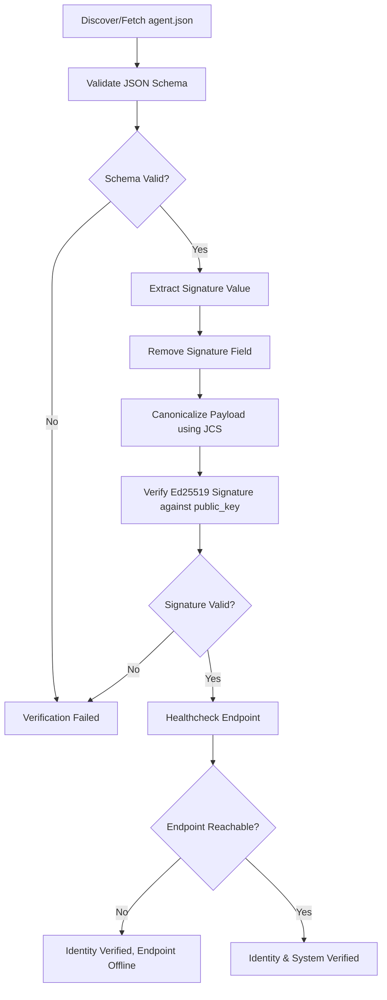

# CREDUENT-001: agent.json Specification

**Status:** Active RFC draft  
**Version:** 1.1.0  
**Creator:** Kashish Kanojia  
**Author:** IDevSec  
**Date:** 2026-05-31  

---

## 1. Introduction & Philosophy

> "Creduent does not decide trust. Creduent enables verifiable trust."

Creduent is an open application-layer protocol for identifying and verifying autonomous systems. As the internet shifts from human-to-website interactions to autonomous agent-to-agent (AI ↔ AI) communication, a protocol-native trust infrastructure layer is required. 

Creduent sits above the existing web stack (HTTPS, DNS, APIs) rather than replacing it. It focuses strictly on identity, cryptographic ownership, and capability exposure. By design:
* **Identity resolution is decentralized:** Anyone can issue an agent ID and identity document without registering with a central gatekeeper or waiting for ICANN naming extensions.
* **Trust is federated:** Verifiable trust is built via composable third-party attestations (e.g., identity verification by Creduent Registry, security verification by auditors, provider verification by LLM platforms) rather than a single monolithic authority.

Kashish Kanojia is the creator of the Creduent Protocol, stewarded by IDevSec as an open, community-driven standard. This ensures that the protocol remains a neutral, objective, and globally accessible standard for the broader artificial intelligence and agentic ecosystem.

### 1.1 The Composite Trust Model

Creduent recognizes that securing autonomous systems is a multi-dimensional challenge. It divides trust verification into six distinct logical layers:

1. **Identity:** Proves *which* agent or workload is acting. Implemented via cryptographic keys (Ed25519) and DNS bindings in the `agent.json` document.
2. **Posture:** Proves *what* instruction and tool surface is loaded. Implemented via the **Agent Prompt Hash (APH)** to verify system instructions, model settings, and allowed schemas. Note that posture is a boundary constraint rather than full behavioral proof, ensuring starting rules remain untampered.
3. **Delegation:** Proves *whose authority* the agent is acting under. Implemented via the **Creduent Delegation Token (CDT)** which binds authority directly to specific action scopes and tool arrays.
4. **Policy:** Defines *what is allowed* in the current session. Checked dynamically by compliant execution gateway enforcers.
5. **Execution Context:** Defines *the boundary of the task* (e.g. current session variables, run metadata).
6. **Evidence:** Proves *what actually happened*. Implemented via signed **Execution Receipts** aggregated into tamper-proof local Merkle Trees.

### 1.2 Threat Model: The WAF Bypass Vulnerability

Traditional network perimeter defenses (e.g. mTLS, TLS 1.3, and Web Application Firewalls) protect the connection pipe. While a WAF is highly effective at identifying and filtering out malicious bot traffic, it is blind to application-layer cognitive payloads. 

When you authorize a vendor's AI agent to access your APIs, their traffic is legitimate. However, if that agent parses an untrusted file and undergoes prompt injection, its subsequent requests still carry valid API keys and pass WAF signature checks. Creduent addresses this gap by verifying software provenance (the APH and code signature) at the receiving gateway, preventing the execution of hijacked instructions.

---

## 2. The `agent.json` Document

Every participating AI system exposes a machine-readable metadata file at a well-known location:
`https://<domain>/.well-known/agent.json`

This file establishes a public cryptographic identity tied directly to a web endpoint and ownership structure.

### 2.1 Core Fields (v1.0)

A v1.0 `agent.json` document consists of the following 8 fields:

1. **`version`** (String, Required)  
   The version of the specification the document conforms to. For this spec, the value MUST be `"1.0"`.
   
2. **`issued_at`** (String, Optional)  
   An RFC 3339 formatted UTC timestamp indicating when the document was generated and signed.  
   *Example:* `"2026-05-27T00:00:00Z"`  
   *Note:* Excluded `expires_at` to avoid false rejections due to clock skew across distributed systems. Lifecycle enforcement belongs to higher-level trust verification layers, not the base identity document.

3. **`agent_id`** (String, Required)  
   The globally unique URI identifier for the agent, following the scheme:  
   `agent://<namespace>/<agent-name>`  
   *Example:* `"agent://idevsec/steward"`  
   *Note on Constraints:* To comply with schema validation, both `<namespace>` and `<agent-name>` MUST consist solely of alphanumeric characters, hyphens (`-`), and underscores (`_`). Sub-namespaces (additional subpaths with `/`), dots (`.`), and other symbols are not supported.
   *Note:* Namespace squatting and ownership validation are resolved at the registry resolution layer.

4. **`owner`** (String, Required)  
   The human-readable name of the entity (individual or organization) that owns and operates the agent.  
   *Example:* `"Creduent"`

5. **`public_key`** (String, Required)  
   The public key used to verify signatures produced by this agent. The string format MUST prefix the algorithm. In v1.0, only Ed25519 is supported.  
   *Format:* `ed25519:<base64-or-hex-public-key>`  
   *Example:* `"ed25519:7c9ab1..."`

6. **`endpoint`** (String, Required)  
   The base HTTPS API url through which this agent receives instructions, handles communication, or delegates tasks.  
   *Example:* `"https://creduent.idevsec.com/assistant"`

7. **`capabilities`** (Array of Strings, Required)  
   A list of semantic tags exposing what functions/tasks this agent is capable of performing.  
   *Example:* `["query", "resolve", "verify"]`

8. **`signature`** (String, Required)  
   The cryptographic signature verifying the integrity and authenticity of the identity document. The signature is computed over the JCS-canonicalized representation of the document *excluding* the `signature` field itself.

### 2.2 Decoupled Structure (v2.0)

Creduent v2.0 introduces a decoupled structure separating cryptographic identity attributes from transient policies:

1. **`version`** (String, Required)  
   The version of the specification. MUST be `"2.0"`.
   
2. **`identity`** (Object, Required)  
   A sub-object containing core cryptographic identity identifiers:
   - **`agent_id`** (String, Required): Globally unique agent URI (`agent://namespace/name`).
   - **`owner`** (String, Required): Identifier of the agent operator.
   - **`keys`** (Array, Required): List of active/revoked public keys. Each entry has:
     - `id` (String): Key identifier.
     - `type` (String): Key type (`"ed25519"`).
     - `public_key` (String): Base64 public key with `ed25519:` prefix.
     - `status` (String): Key status (`"active"` or `"revoked"`).
     - `expires_at` (String, Optional): Key expiration timestamp.
   - **`endpoint`** (String, Required): HTTPS endpoint base URL.
   - **`delegated_from`** (String, Optional): Placeholder for delegation chains.
   
3. **`policy`** (Object, Required)  
   A sub-object containing transient policy details:
   - **`capabilities`** (Array of Strings, Required): Verifiable tags of semantic functionality.
   
4. **`signature`** (String, Required)  
   The Base64 Ed25519 signature computed over the JCS-canonicalized representation of the document *excluding* the `signature` field itself.

-----

## 3. Cryptographic Signing & Canonicalization

To ensure that the identity document cannot be tampered with, it must be signed by the private key corresponding to the public key declared in the `public_key` field.

### 3.1 Canonicalization (RFC 8785)

Because different parsers serialize JSON differently (e.g., whitespace variations, property sorting), documents MUST be canonicalized before signing and verification.
Creduent uses **RFC 8785: JSON Canonicalization Scheme (JCS)** to format the JSON payload consistently:
* Properties are sorted lexicographically.
* Unnecessary whitespaces are removed.
* String escapes and numbers are normalized.

### 3.2 Signing Algorithm

1. Construct the `agent.json` document containing all fields *except* the `signature` field.
2. Canonicalize the JSON object according to **RFC 8785**.
3. Generate an **Ed25519** signature using the agent's private key over the UTF-8 encoded bytes of the canonical JSON string.
4. Encode the signature in **Base64** format (standard or URL-safe without padding).
5. Append the `"signature"` field to the final `agent.json` document with the generated Base64 string.

---

## 4. Verification Workflow

An agent verifier (or client) MUST perform the following checks when encountering an `agent.json` identity document:



1. **Discovery & Retrieval:** Fetch the `agent.json` from the target well-known path or resolve it via the registry using `agent_id`.
2. **Schema Verification:** Ensure the document adheres exactly to the structural schema.
3. **Payload Separation:** Extract the value of `"signature"`, then remove the `"signature"` key from the JSON object.
4. **JCS Canonicalization:** Apply JCS (RFC 8785) to the signature-less document to obtain a canonical byte array.
5. **Signature Verification:** Decode the Base64 signature and verify it using the Ed25519 public key declared in the document itself.
6. **Optional Connectivity Check:** Verify if the declared `endpoint` is active and returns a valid state.

---

## 5. Security & Liability Boundaries

* **Integrity and Ownership:** The protocol guarantees only that the controller of the private key matches the declared metadata and has authorized the endpoints.
* **No Trust Assumption:** Verification of `agent.json` does not guarantee the agent is non-malicious. Higher layers (Federated Attestations) must attest to the agent's behavior, reputation, and credentials.

---

## 6. Registry & Attestation Layer

Self-signed identity documents (agent.json) establish cryptographic ownership but cannot prove domain association, endpoint availability, or administrative validation. To bridge this gap, Creduent incorporates an Attestation Registry.

### 6.1 Role of the Registry
The registry acts as a validation authority that checks self-signed agent identity claims against external indicators of trust (such as DNS binding and endpoint reachability) and issues short-lived, cryptographically signed attestations.

### 6.2 Attestation Object Structure
A Creduent attestation is a JSON document consisting of the following fields:

1. **`agent_id`** (String, Required)
   The agent's globally unique URI identifier.
2. **`issuer`** (String, Required)
   The identity URI of the attestation registry. Value MUST be `"agent://creduent/registry"`.
3. **`level`** (String, Required)
   The verification level. Possible values: `"unverified"`, `"verified"`, `"trusted"`, `"revoked"`.
4. **`issued_at`** (String, Required)
   An RFC 3339 formatted UTC timestamp of when the attestation was issued.
5. **`expires_at`** (String, Required)
   An RFC 3339 formatted UTC timestamp indicating when the attestation expires.
6. **`public_key`** (String, Required)
   The public key of the agent, matching its agent.json.
7. **`domain`** (String, Required)
   The target domain under which the agent operates.
8. **`signature`** (String, Required)
   The Ed25519 cryptographic signature generated by the registry over the JCS-canonicalized representation of the attestation document (excluding the signature field itself).

### 6.3 Registration Flow
To register an agent, the owner submits the agent's URI, domain, and agent.json URL via a `POST /register` request. The registry executes the following verification pipeline:

1. **Fetch & SSRF Check:** The registry fetches the agent.json document from the provided URL, enforcing SSRF protections (blocking private/loopback IP addresses).
2. **Schema & Signature Validation:** The registry validates the fetched document against the agent schema and checks the Ed25519 signature using the agent's declared public key.
3. **DNS TXT Verification:** The registry performs a DNS TXT lookup for the record `_creduent.{domain}` and verifies that its content matches the agent_id.
4. **Endpoint Healthcheck:** The registry performs an HTTP request to the agent's declared endpoint to ensure connectivity.
5. **Issue Attestation:** If all verification steps succeed, the registry signs the attestation payload using its private key and stores the attestation in the registry database.

> **Note:** Developers may also register directly via `POST /attest` using Agent ID, Domain, and Public Key without providing `agent_json_url`. This is intended for dashboard and programmatic use.

### 6.4 Revocation Model
Administrators can revoke an agent's registration by submitting a request to the `/revoke/{agent_id}` endpoint. This requires admin authorization (either via multisig headers `CREDUENT-ADMIN-KEYS`, `CREDUENT-ADMIN-SIGNATURES`, `CREDUENT-ADMIN-TIMESTAMP`, or legacy symmetric `CREDUENT-ADMIN-KEY`). Revoked agents have their attestation level set to `revoked`, and subsequent queries to `/attest/{agent_id}` will return `level: revoked` (returning a `410 Gone` HTTP status code).

### 6.5 DNS TXT Record Format
To bind a web domain to a Creduent identity, the domain owner MUST configure a DNS TXT record under the `_creduent` subdomain.
- **Record Name:** `_creduent.{domain}`
- **Record Value:** `{agent_id}`
- **Example:** `_creduent.example.com TXT "agent://example/mybot"`

### 6.6 Renewal
Agents may renew their attestation before expiry via `POST /renew`.

**Request body:**
```json
{
  "agent_id": "agent://example/mybot",
  "new_expires_at": "2028-05-30T00:00:00Z",
  "signature": "<base64_signature>"
}
```

The signature MUST be computed over the pipeline-delimited string: `agent_id|new_expires_at`, signed with the agent's private key. On success, the registry re-signs and persists the updated attestation.

### 6.7 Webhook Notifications
Owners may register a webhook URL via `POST /webhook/register`. The auto-renewal daemon runs daily and fires a POST to the registered webhook 30 days before attestation expiry.

**Webhook payload:**
```json
{
  "event": "agent.expiry_warning",
  "agent_id": "agent://example/mybot",
  "domain": "example.com",
  "expires_at": "2027-05-30T00:00:00Z",
  "days_remaining": 28,
  "action_url": "https://creduent.idevsec.com/renew"
}
```

### 6.8 Challenge-Response Authentication
Agents can prove their cryptographically registered identity to other agents in a secure, session-locked, and decentralized manner using challenge-response:
1. **Challenge Generation:** The client requests a challenge for `agent_id` from the registry via `GET /challenge/{agent_id}`. The registry generates a cryptographically random, 32-byte hex `challenge` and a 16-byte hex `nonce`, storing them with a 5-minute TTL.
2. **Signature Proof Creation:** The proving agent receives the challenge and nonce. It signs the UTF-8 encoded `SHA-256` hash of `challenge + nonce` using its Ed25519 private key.
3. **Verification and Token Issue:** The agent submits `agent_id`, `nonce`, and `signature` to `POST /verify-challenge`. The registry resolves the agent's registered public key, verifies the signature over the hashed challenge-nonce string, deletes the challenge to prevent reuse (replay protection), and responds with a cryptographically signed `proof_token` (valid for 1 hour).
4. **Independent Proof Verification:** The verifying agent receives the `proof_token`. It base64-decodes it, fetches the registry's public key from `GET /public-key`, and verifies the registry's signature on the token payload, confirming the identity and attestation validity without making repeated network calls to the registry.

---

## 7. MCP Integration

Creduent integrates into agent host environments via the Model Context Protocol (MCP), exposing a `verify_agent` tool that automates validation workflows.

### 7.1 Operation of verify_agent
The verify_agent tool resolves a target agent identifier, performs self-verification, and queries the configured Creduent registry for attestation details.

### 7.2 Response Object Schema
The tool returns a JSON object containing:
- `agent_id` (String): The resolved agent identifier.
- `self_verified` (Boolean): True if the agent's self-signed document is cryptographically valid.
- `creduent_attested` (Boolean): True if the registry's signature on the attestation is verified.
- `attestation_level` (String): The status of registry verification:
  - `"verified"`: Valid registration and valid registry attestation signature.
  - `"trusted"`: High authority trust level assigned via admin attestation.
  - `"unregistered"`: Cryptographically valid self-signed agent document, but no active registry attestation.
  - `"registry_offline"`: Degraded verification state when the registry cannot be reached.
- `attestation_issued_at` (String or null): The RFC 3339 timestamp of attestation issuance.
- `attestation_expires_at` (String or null): The RFC 3339 timestamp of attestation expiration.
- `public_key` (String): The agent's public key.
- `endpoint` (String): The agent's endpoint URL.
- `capabilities` (Array of Strings): The agent's declared capability tags.
- `checked_at` (String): The RFC 3339 timestamp of when the check was performed.

### 7.3 Graceful Degradation
If the Creduent registry is offline or unreachable, the verify_agent tool MUST NOT fail verification. Instead, it completes self-verification and returns:
- `self_verified`: `true` (if self-signature is valid)
- `creduent_attested`: `false`
- `attestation_level`: `"registry_offline"`

### 7.4 Example Response
```json
{
  "agent_id": "agent://example/mybot",
  "self_verified": true,
  "creduent_attested": true,
  "attestation_level": "verified",
  "attestation_issued_at": "2026-05-29T00:00:00Z",
  "attestation_expires_at": "2026-06-28T00:00:00Z",
  "public_key": "ed25519:hArTvbITJ2jirL170IOSjcVvEvstC4s+RjYLu4chCwg=",
  "endpoint": "https://api.example.com",
  "capabilities": ["scan"],
  "checked_at": "2026-05-29T01:50:00Z"
}
```

---

## 8. Official SDKs

### 8.1 Python SDK
```bash
pip install creduent
```
Methods: `sign()`, `verify()`, `register()`, `attest()`  
Source: https://github.com/idevsec/creduent-python

### 8.2 JavaScript / TypeScript SDK
```bash
npm install @idevsec/creduent
```
Functions: `resolveAgent()`, `verifyAgent()`, `registerAgent()`  
Types: `AgentRecord`, `RegisterPayload`, `ClientOptions`  
Source: https://github.com/idevsec/creduent-js

### 8.3 CLI Tool (JavaScript / TypeScript)
```bash
npm install -g @idevsec/creduent-cli
```
Source: https://github.com/idevsec/creduent-cli

---

## 9. Identity-Based Rate Limiting & Abuse Reporting (IBRL)

To prevent autonomous AI agents from exploiting API endpoints at scale (e.g., rapid vulnerability scanning, brute-forcing, or data scraping), Creduent supports **Identity-Based Rate Limiting (IBRL)**. By tying rate limits to a cryptographically verified `agent_id` rather than transient IP addresses, system administrators can isolate and block malicious agent behaviors deterministically.

### 9.1 Middleware Architecture
Creduent-compliant server SDKs provide middleware to automatically extract, verify, and track the calling agent's cryptographic identity:
1. **Identity Extraction**: The middleware extracts the client's `agent_id` and the cryptographic signature from incoming headers (e.g., `X-Creduent-Agent-ID` and `X-Creduent-Signature`).
2. **Signature Verification**: The middleware verifies the signature. If invalid, the request is rejected with `HTTP 401 Unauthorized`.
3. **Throttling Policy**: The verified `agent_id` is queried against a local cache or rate-limiting store (e.g., Redis). If the agent exceeds configured request thresholds, the server responds with `HTTP 429 Too Many Requests`.

### 9.2 Abuse Detection & Threat Intelligence
In addition to standard rate-limiting, servers should monitor for **malicious behavior patterns**:
*   **Vulnerability Probing**: If a single `agent_id` generates a high frequency of `4xx` error responses (such as `400 Bad Request`, `403 Forbidden`, `404 Not Found`) within a short time window, it is flagged as performing malicious probing.
*   **Identity-Based Throttling**: Flagged agent IDs are temporarily blocked at the server gateway (returning `HTTP 403 Forbidden` for all subsequent requests).

### 9.3 Decentralized Abuse Reporting
To protect the broader ecosystem, servers can report malicious agent behavior back to the central Creduent registry:

**Request format:**
`POST /report-abuse`
```json
{
  "agent_id": "agent://example/mybot",
  "reporter_domain": "target-api.com",
  "reason": "Vulnerability scanning detected: 50 requests targeting non-existent endpoints within 10 seconds.",
  "evidence": {
    "log_sample": [
      { "timestamp": "2026-07-03T00:00:01Z", "path": "/admin/config", "status": 404 },
      { "timestamp": "2026-07-03T00:00:02Z", "path": "/etc/passwd", "status": 404 }
    ],
    "client_signature": "<original_base64_signature_from_agent>"
  },
  "signature": "<reporter_signature>"
}
```

The registry validates the signature of the reporting server, verifies the evidence, and updates the agent's attestation level. If malicious intent is confirmed, the registry downgrades the agent's attestation status to `flagged` or `revoked`, instantly warning or blocking all other gateway nodes querying the registry for that `agent_id`.