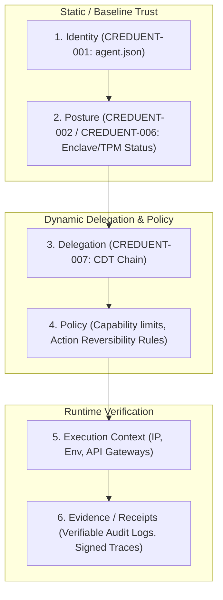
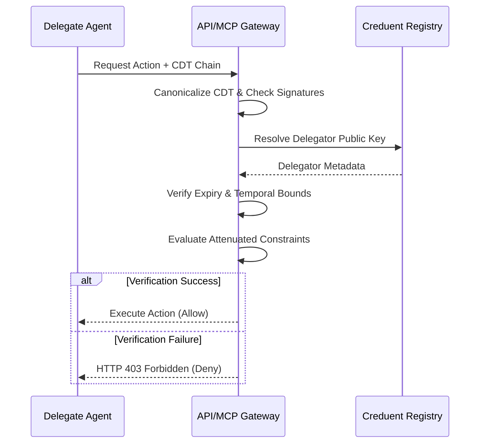

# CREDUENT-007: Creduent Delegation Token (CDT) Specification

**Status:** Draft  
**Version:** 0.1  
**Author:** IDevSec  
**Date:** 2026-07-21  
**Related:** [CREDUENT-001](CREDUENT-001-agent-json.md), [CREDUENT-002](CREDUENT-002-attestation.md), [CREDUENT-006](CREDUENT-006-dynamic-attestation.md)

---

## 1. Introduction & Overview

As autonomous AI agents collaborate in multi-agent hierarchies or delegate sub-tasks to downstream specialized agents, they require a secure, standard mechanism to pass authorization. 

Sharing a primary agent key or an all-powerful API credential violates the principle of least privilege. If a sub-agent is compromised, the parent identity is fully exposed.

**CREDUENT-007** introduces the **Creduent Delegation Token (CDT)**. A CDT is a cryptographically signed, time-bound, and capability-attenuated token issued by a parent agent identity (the Delegator) to a child agent identity (the Delegate). It forms the cryptographic foundation for delegation in the **6-Layer Composite Trust Model**.

---

## 2. The 6-Layer Composite Trust Model

The Creduent Protocol maps agent invocation security onto a 6-layer trust architecture. The CDT acts as the third layer, bridging static identity/posture with dynamic policy and runtime evidence:



1. **Identity:** Cryptographically verified agent identifier (`agent_id`) and public key.
2. **Posture / Attestation:** Real-time health, registry status, and hardware enclave credentials (TPM 2.0 / Intel SGX).
3. **Delegation:** Verifiable tokens (CDTs) establishing authorization provenance from a parent to a child.
4. **Policy:** Declared capability bounds, invocation limits, and maximum allowed action reversibility class.
5. **Execution Context:** Transient environment parameters (network gateways, host metadata).
6. **Evidence:** Verifiable execution trace hashes and receipts representing actual runtime behavior.

---

## 3. Creduent Delegation Token (CDT) Schema

A Creduent Delegation Token is represented as a canonical JSON document containing the delegation parameters and the delegator's signature:

```json
{
  "version": "1.0",
  "token_id": "urn:uuid:c271d3c2-1efc-4114-8f41-4eed86c4ed07",
  "issued_at": "2026-07-21T00:00:00Z",
  "expires_at": "2026-07-21T01:00:00Z",
  "delegator": "agent://example/parent-agent",
  "delegate": "agent://example/child-agent",
  "delegate_public_key": "ed25519:delegate_public_key_bytes_here",
  "constraints": {
    "allowed_capabilities": ["scan", "query"],
    "max_reversibility": "reversible",
    "allowed_tools": ["tavily_search", "fetch_url"],
    "max_token_spend": 50000,
    "invocation_limit": 100
  },
  "intent_hash": "sha256:e3b0c44298fc1c149afbf4c8996fb92427ae41e4649b934ca495991b7852b855",
  "signature": "base64_delegator_signature_here"
}
```

### 3.1 Field Specification

| Field | Type | Required | Description |
|:---|:---|:---|:---|
| `version` | String | Yes | Version of the CDT specification (currently `"1.0"`). |
| `token_id` | String | Yes | Globally unique identifier (UUID URN) for token tracking and revocation checks. |
| `issued_at` | String | Yes | ISO 8601 timestamp of token issuance. |
| `expires_at` | String | Yes | ISO 8601 timestamp of token expiry (recommended maximum lifetime of 24 hours). |
| `delegator` | String | Yes | Creduent URI of the issuing agent. |
| `delegate` | String | Yes | Creduent URI of the authorized agent. |
| `delegate_public_key` | String | Yes | The Ed25519 public key of the delegate agent, preventing key spoofing. |
| `constraints` | Object | Yes | Attenuated authorization parameters (see Section 3.2). |
| `intent_hash` | String | No | Cryptographic hash binding the token to a specific parent trace or prompt (see Section 4). |
| `signature` | String | Yes | Ed25519 signature computed by the delegator over the JCS-canonicalized token payload (excluding `signature`). |

### 3.2 Constraint Attributes

* **`allowed_capabilities` (Array of Strings):** Narrowed list of Capabilities the delegate is allowed to invoke (must be a subset of the delegator's own capability set).
* **`max_reversibility` (String):** The maximum reversibility tier (compliant with `CREDUENT-006` classification) the delegate can execute: `read-only`, `reversible`, `external-reversible`, or `irreversible`.
* **`allowed_tools` (Array of Strings):** Explicit whitelist of tools/API methods the delegate is allowed to trigger.
* **`max_token_spend` (Integer):** Maximum cumulative LLM tokens (prompt + completion) the delegate is authorized to consume under this delegation window.
* **`invocation_limit` (Integer):** Maximum number of downstream tool calls or API requests allowed before the token automatically invalidates.

---

## 4. Intent-to-Action Cryptographic Binding

To prevent the delegate agent from deviating from its assigned sub-task, the delegation token SHOULD be cryptographically bound to the delegator's parent execution context:

1. **Intention Hash Generation:** The delegator computes a SHA-256 hash of the parent agent's active system prompt, active query, and parent observability trace ID (e.g., Langfuse Trace ID):
   $$\text{intent\_hash} = \text{SHA256}(\text{system\_prompt} \mathbin{\Vert} \text{user\_query} \mathbin{\Vert} \text{trace\_id})$$
2. **Token Embedding:** The computed `intent_hash` is included inside the CDT payload prior to JCS serialization and signing.
3. **Gateway Verification:** When a downstream gateway processes a tool call from the delegate, it compares the active execution trace telemetry with the signed `intent_hash`. If a mismatch is detected (e.g., the prompt has been modified or the action does not match the parent's task context), the invocation is rejected.

---

## 5. Verifiable Audit Logging

To trace multi-agent execution flows for compliance auditing, CDTs MUST be linked directly to execution logs:

* **Invocation Trace Linkage:** Every downstream HTTP request or tool call made by the delegate agent MUST carry the CDT inside the headers:
  `X-Creduent-Delegation-Token: <serialized_cdt_json_or_jwt>`
* **Trace Signature Chaining:** Downstream logs recorded by execution gateways (e.g., Langfuse, Portkey, or custom MCP gateways) must record:
  * The current agent's signature of the output.
  * The parent agent's delegation signature (`signature` from the CDT).
  * This creates a verifiable chain of custody showing exactly which agent authorized which sub-action.

---

## 6. SDK Verification & Gateway Enforcement

### 6.1 SDK Helper Functions

Conforming Creduent SDKs (Python and JS/TS) must implement the following cryptographic delegation primitives:

#### Python SDK Signature
```python
def sign_delegation(
    delegator_private_key: bytes,
    delegator_uri: str,
    delegate_uri: str,
    delegate_public_key: str,
    constraints: dict,
    intent_hash: str = None,
    ttl_seconds: int = 3600
) -> dict:
    """
    Constructs, JCS-canonicalizes, signs, and returns a Creduent Delegation Token (CDT).
    """
    ...
```

#### JS/TS SDK Signature
```typescript
async function verifyDelegationChain(
  cdtChain: object[],
  targetAction: string,
  registryClient: CreduentRegistryClient
): Promise<boolean>;
```

### 6.2 Gateway Enforcement Flow

When an API Gateway (e.g. LLM routing gateway, database proxy, or MCP Host) receives an action request accompanied by a delegation chain:



1. **Chain Traversal:** Iterate through the `cdtChain` from the leaf delegate to the root delegator.
2. **Signature Verification:** For each token in the chain, extract the delegator URI, fetch the corresponding public key, JCS-canonicalize the token payload, and verify the Ed25519 signature.
3. **Temporal Verification:** Verify that `issued_at` <= current time < `expires_at` for every token.
4. **Constraint Narrowing:** Ensure that constraints become strictly narrower at each step of the delegation chain (e.g., Delegate B cannot have capabilities that Delegate A did not delegate to it).
5. **Fail-Closed Default:** If any check fails, or if a registry lookup returns `revoked` for any key in the delegation chain, the request MUST fail-closed and reject execution immediately.
