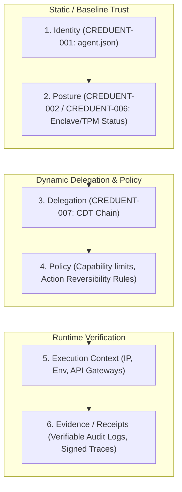
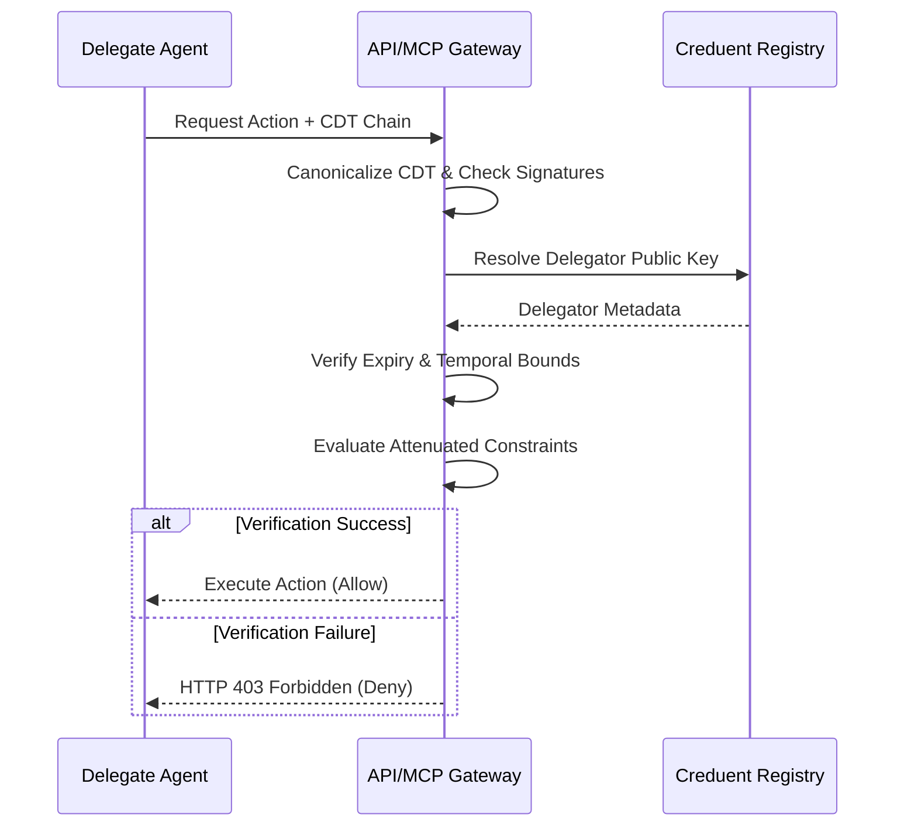

# CREDUENT-007: Creduent Delegation Token (CDT) Specification

**Status:** Draft  
**Version:** 0.2  
**Author:** IDevSec  
**Date:** 2026-07-21  
**Related:** [CREDUENT-001](CREDUENT-001-agent-json.md), [CREDUENT-002](CREDUENT-002-attestation.md), [CREDUENT-006](CREDUENT-006-dynamic-attestation.md)

---

## 1. Introduction & Overview

As autonomous AI agents collaborate in multi-agent hierarchies or delegate sub-tasks to downstream specialized agents, they require a secure, standard mechanism to pass authorization. 

Sharing a primary agent key or an all-powerful API credential violates the principle of least privilege. If a sub-agent is compromised, the parent identity is fully exposed.

**CREDUENT-007** introduces the **Creduent Delegation Token (CDT)**. A CDT is a cryptographically signed, time-bound, and capability-attenuated token issued by a parent agent identity (the Delegator) to a child agent identity (the Delegate). It forms the cryptographic foundation for delegation in the **6-Layer Composite Trust Model**.

---

## 2. The 6-Layer Composite Trust Model

The Creduent Protocol maps agent invocation security onto a 6-layer trust architecture. The CDT acts as the third layer, bridging static identity/posture with dynamic policy and runtime evidence:



1. **Identity:** Cryptographically verified agent identifier (`agent_id`) and public key.
2. **Posture / Attestation:** Real-time health, registry status, and hardware enclave credentials (TPM 2.0 / Intel SGX).
3. **Delegation:** Verifiable tokens (CDTs) establishing authorization provenance from a parent to a child.
4. **Policy:** Declared capability bounds, invocation limits, and maximum allowed action reversibility class.
5. **Execution Context:** Transient environment parameters (network gateways, host metadata).
6. **Evidence:** Verifiable execution trace hashes and receipts representing actual runtime behavior.

---

## 3. Creduent Delegation Token (CDT) Schema

A Creduent Delegation Token is represented as a canonical JSON document containing the delegation parameters and the delegator's signature:

```json
{
  "version": "1.0",
  "token_id": "urn:uuid:c271d3c2-1efc-4114-8f41-4eed86c4ed07",
  "issued_at": "2026-07-21T00:00:00Z",
  "expires_at": "2026-07-21T01:00:00Z",
  "delegator": "agent://example/parent-agent",
  "delegate": "agent://example/child-agent",
  "delegate_public_key": "ed25519:delegate_public_key_bytes_here",
  "constraints": {
    "allowed_capabilities": ["scan", "query"],
    "max_reversibility": "reversible",
    "allowed_tools": ["tavily_search", "fetch_url"],
    "max_token_spend": 50000,
    "invocation_limit": 100
  },
  "intent_hash": "sha256:e3b0c44298fc1c149afbf4c8996fb92427ae41e4649b934ca495991b7852b855",
  "signature": "base64_delegator_signature_here"
}
```

### 3.1 Field Specification

| Field | Type | Required | Description |
|:---|:---|:---|:---|
| `version` | String | Yes | Version of the CDT specification (currently `"1.0"`). |
| `token_id` | String | Yes | Globally unique identifier (UUID URN) for token tracking and revocation checks. |
| `issued_at` | String | Yes | ISO 8601 timestamp of token issuance. |
| `expires_at` | String | Yes | ISO 8601 timestamp of token expiry (recommended maximum lifetime of 24 hours). |
| `delegator` | String | Yes | Creduent URI of the issuing agent. |
| `delegate` | String | Yes | Creduent URI of the authorized agent. |
| `delegate_public_key` | String | Yes | The Ed25519 public key of the delegate agent, preventing key spoofing. |
| `constraints` | Object | Yes | Attenuated authorization parameters (see Section 3.2). |
| `intent_hash` | String | No | Cryptographic hash binding the token to a specific parent trace or prompt (see Section 4). |
| `signature` | String | Yes | Ed25519 signature computed by the delegator over the JCS-canonicalized token payload (excluding `signature`). |

### 3.2 Constraint Attributes

* **`allowed_capabilities` (Array of Strings):** Narrowed list of Capabilities the delegate is allowed to invoke (must be a subset of the delegator's own capability set).
* **`max_reversibility` (String):** The maximum reversibility tier (compliant with `CREDUENT-006` classification) the delegate can execute: `read-only`, `reversible`, `external-reversible`, or `irreversible`.
* **`allowed_tools` (Array of Strings):** Explicit whitelist of tools/API methods the delegate is allowed to trigger.
* **`max_token_spend` (Integer):** Maximum cumulative LLM tokens (prompt + completion) the delegate is authorized to consume under this delegation window.
* **`invocation_limit` (Integer):** Maximum number of downstream tool calls or API requests allowed before the token automatically invalidates.

---

## 4. Intent-to-Action Cryptographic Binding

To prevent the delegate agent from deviating from its assigned sub-task, the delegation token SHOULD be cryptographically bound to the delegator's parent execution context:

1. **Intention Hash Generation:** The delegator computes a SHA-256 hash of the parent agent's active system prompt, active query, and parent observability trace ID (e.g., Langfuse Trace ID):
   $$\text{intent\_hash} = \text{SHA256}(\text{system\_prompt} \mathbin{\Vert} \text{user\_query} \mathbin{\Vert} \text{trace\_id})$$
2. **Token Embedding:** The computed `intent_hash` is included inside the CDT payload prior to JCS serialization and signing.
3. **Gateway Verification:** When a downstream gateway processes a tool call from the delegate, it compares the active execution trace telemetry with the signed `intent_hash`. If a mismatch is detected (e.g., the prompt has been modified or the action does not match the parent's task context), the invocation is rejected.

---

## 5. Verifiable Audit Logging

To trace multi-agent execution flows for compliance auditing, CDTs MUST be linked directly to execution logs:

* **Invocation Trace Linkage:** Every downstream HTTP request or tool call made by the delegate agent MUST carry the CDT inside the headers:
  `X-Creduent-Delegation-Token: <serialized_cdt_json_or_jwt>`
* **Trace Signature Chaining:** Downstream logs recorded by execution gateways (e.g., Langfuse, Portkey, or custom MCP gateways) must record:
  * The current agent's signature of the output.
  * The parent agent's delegation signature (`signature` from the CDT).
  * This creates a verifiable chain of custody showing exactly which agent authorized which sub-action.

---

## 6. SDK Verification & Gateway Enforcement

### 6.1 SDK Helper Functions

Conforming Creduent SDKs (Python and JS/TS) must implement the following cryptographic delegation primitives:

#### Python SDK Signature
```python
def sign_delegation(
    delegator_private_key: bytes,
    delegator_uri: str,
    delegate_uri: str,
    delegate_public_key: str,
    constraints: dict,
    intent_hash: str = None,
    ttl_seconds: int = 3600
) -> dict:
    """
    Constructs, JCS-canonicalizes, signs, and returns a Creduent Delegation Token (CDT).
    """
    ...
```

#### JS/TS SDK Signature
```typescript
async function verifyDelegationChain(
  cdtChain: object[],
  targetAction: string,
  registryClient: CreduentRegistryClient
): Promise<boolean>;
```

### 6.2 Gateway Enforcement Flow

When an API Gateway (e.g. LLM routing gateway, database proxy, or MCP Host) receives an action request accompanied by a delegation chain:



1. **Chain Traversal:** Iterate through the `cdtChain` from the leaf delegate to the root delegator.
2. **Signature Verification:** For each token in the chain, extract the delegator URI, fetch the corresponding public key, JCS-canonicalize the token payload, and verify the Ed25519 signature.
3. **Temporal Verification:** Verify that `issued_at` <= current time < `expires_at` for every token.
4. **Constraint Narrowing:** Ensure that constraints become strictly narrower at each step of the delegation chain (e.g., Delegate B cannot have capabilities that Delegate A did not delegate to it).
5. **Fail-Closed Default:** If any check fails, or if a registry lookup returns `revoked` for any key in the delegation chain, the request MUST fail-closed and reject execution immediately.

---

## 7. Security Considerations

### 7.1 Privilege Escalation Prevention

A delegate agent **MUST NOT** be able to grant capabilities it does not itself hold. The gateway MUST enforce this by comparing each CDT's `constraints.allowed_capabilities` against the parent CDT (or the root delegator's attestation capabilities). Any attempt to expand scope is a fatal verification failure.

```
Root Agent:       allowed_capabilities = ["scan", "query", "write"]
  └─ Child A:     allowed_capabilities = ["scan", "query"]         ✓ OK (subset)
      └─ Child B: allowed_capabilities = ["scan", "query", "write"] ✗ REJECTED (escalation)
      └─ Child C: allowed_capabilities = ["scan"]                  ✓ OK (narrower)
```

### 7.2 Replay Attack Mitigation

CDTs contain `issued_at` and `expires_at` fields. Gateways MUST:

1. Reject any CDT where `expires_at` ≤ current UTC time.
2. Reject any CDT where `issued_at` is more than 5 minutes in the future (clock skew tolerance).
3. Optionally maintain a short-lived token replay cache indexed by `token_id` to block re-use of non-expired tokens that have been explicitly invalidated.

### 7.3 Key Binding & Spoofing Prevention

The `delegate_public_key` field inside the CDT MUST match the public key registered in the Creduent Registry for the `delegate` URI. This prevents an attacker from:

- Forging a CDT that nominates a legitimate `delegate` URI but points to their own key.
- Impersonating a delegated agent by substituting its identity document.

### 7.4 Max Chain Depth

Implementations SHOULD enforce a maximum delegation chain depth of **8 hops** to prevent unbounded recursive delegation. If the chain length exceeds the configured limit, the request MUST be rejected with error `CDT_CHAIN_DEPTH_EXCEEDED`.

### 7.5 Intent Hash Verification

When `intent_hash` is present, the gateway MUST verify it against the active execution trace context. Implementations that cannot access the parent trace context SHOULD treat a mismatch as a fatal error rather than silently skipping the check.

### 7.6 Transport Security

CDT tokens MUST only be transmitted over connections secured with TLS 1.2 or higher. Transmission over plaintext HTTP is explicitly prohibited by this specification.

---

## 8. Error Codes

Implementations returning error responses for CDT verification failures MUST use the following standardized error codes in their response body:

| Error Code | HTTP Status | Description |
|:---|:---|:---|
| `CDT_SIGNATURE_INVALID` | 403 | Ed25519 signature on the CDT does not verify against the delegator's public key. |
| `CDT_EXPIRED` | 403 | The `expires_at` timestamp has passed. |
| `CDT_NOT_YET_VALID` | 403 | The `issued_at` timestamp is more than 5 minutes in the future. |
| `CDT_DELEGATOR_REVOKED` | 403 | The delegator's Creduent attestation has been revoked in the registry. |
| `CDT_CONSTRAINT_VIOLATION` | 403 | The requested action or capability exceeds the constraint set declared in the CDT. |
| `CDT_PRIVILEGE_ESCALATION` | 403 | The CDT grants capabilities not held by the delegator. |
| `CDT_KEY_MISMATCH` | 403 | The `delegate_public_key` does not match the key registered for the `delegate` URI. |
| `CDT_INTENT_HASH_MISMATCH` | 403 | The `intent_hash` in the CDT does not match the active execution trace context. |
| `CDT_CHAIN_DEPTH_EXCEEDED` | 403 | The delegation chain length exceeds the implementation's maximum allowed depth. |
| `CDT_MALFORMED` | 400 | The CDT JSON cannot be parsed or is missing required fields. |
| `CDT_REGISTRY_LOOKUP_FAILED` | 502 | The gateway could not reach the Creduent Registry to verify the delegator's public key. |

### Error Response Format

```json
{
  "error": "CDT_SIGNATURE_INVALID",
  "message": "Ed25519 signature verification failed for delegator agent://example/parent-agent",
  "token_id": "urn:uuid:c271d3c2-1efc-4114-8f41-4eed86c4ed07",
  "timestamp": "2026-07-21T00:00:00Z"
}
```

---

## 9. Token Revocation

### 9.1 Registry-Based Revocation

A CDT is implicitly revoked when the delegator agent's attestation status in the Creduent Registry is set to `revoked`. Gateways MUST check the delegator's registry status for every CDT in the chain before permitting execution.

**Recommended cache TTL for registry lookups:** 60 seconds. Gateways MAY cache a positive lookup result for up to this duration, but MUST NOT cache a revoked status — revocation lookups must be treated as non-cacheable.

### 9.2 Out-of-Band Token Revocation (Future Extension)

CREDUENT-007 v1.0 does not define a dedicated token revocation endpoint. Future versions may introduce a `/cdt/revoke` registry endpoint that accepts the `token_id` and a signature from the delegator, invalidating the specific token before its `expires_at`. Until then, revocation is handled by revoking the delegator's root attestation.

### 9.3 Short TTL Best Practice

As a practical mitigation, delegators SHOULD issue CDTs with the shortest TTL sufficient for the sub-task:

| Task Type | Recommended TTL |
|:---|:---|
| Single tool call | 60 seconds |
| Short workflow (< 10 steps) | 5–15 minutes |
| Extended task session | 1–4 hours |
| Maximum allowed | 24 hours |

---

## 10. Comparison with JWT / OAuth 2.0 Delegation

CREDUENT-007 CDTs deliberately differ from JWT Bearer tokens and OAuth 2.0 delegation patterns in several important ways:

| Dimension | CDT (CREDUENT-007) | JWT Bearer Token | OAuth 2.0 |
|:---|:---|:---|:---|
| **Identity Substrate** | Creduent `agent://` URIs + registry-attested Ed25519 keys | Arbitrary claims; key from JWKS | User or service accounts via authorization server |
| **Signing Algorithm** | Ed25519 (deterministic, 64-byte signatures) | RS256 / ES256 / EdDSA (configurable) | Varies by AS implementation |
| **Canonicalization** | RFC 8785 JCS (strict deterministic JSON) | None (binary compact serialization) | None |
| **Capability Attenuation** | First-class `constraints` object; chain narrowing enforced | Scope strings only; no chain narrowing | Scope strings; no chain narrowing |
| **Registry Binding** | Delegator key MUST be verifiable in the Creduent Registry | Optional; JWKS may be embedded or fetched | Authorization server is the trust anchor |
| **Intent Binding** | Optional `intent_hash` binds token to parent execution context | Not supported | Not supported |
| **Revocation** | Via delegator attestation revocation or short TTL | Token introspection endpoint required | Token introspection / refresh revocation |
| **Chain Depth Enforcement** | Explicit spec requirement (max 8 hops) | Not specified | Not specified |
| **Audit Logging** | `X-Creduent-Delegation-Token` header in all downstream calls creates verifiable chain-of-custody | Opaque to downstream services | Opaque to downstream services |
| **Design Target** | Machine-to-machine AI agent authorization | Web API authorization | Delegated user authorization |

**When to use CDTs over JWT:**
- The delegating agent's identity is already managed by the Creduent Protocol.
- You need verifiable constraint attenuation across a multi-hop agent chain.
- You require cryptographic audit trail linking downstream actions to a parent agent's signed intent.

**When JWT/OAuth may be sufficient:**
- One-hop API authorization between known services.
- User-facing OAuth flows where agents act on behalf of human users.

---

## 11. Conformance Requirements

An implementation claiming conformance with CREDUENT-007 MUST satisfy the following requirements:

### 11.1 Delegator (Token Issuer) Requirements

- [ ] **CDT-C01:** MUST construct the CDT payload including all required fields as defined in Section 3.
- [ ] **CDT-C02:** MUST JCS-canonicalize the payload (excluding `signature`) per RFC 8785 before signing.
- [ ] **CDT-C03:** MUST sign using the delegator's registered Ed25519 private key.
- [ ] **CDT-C04:** MUST NOT grant `constraints.allowed_capabilities` that exceed the delegator's own attested capabilities.
- [ ] **CDT-C05:** MUST set `expires_at` to a value no greater than 24 hours from `issued_at`.
- [ ] **CDT-C06:** MUST include `delegate_public_key` matching the delegate's registered key.

### 11.2 Gateway / Verifier Requirements

- [ ] **CDT-V01:** MUST verify the Ed25519 signature against the delegator's public key fetched from the Creduent Registry.
- [ ] **CDT-V02:** MUST reject the CDT if `expires_at` ≤ current UTC time.
- [ ] **CDT-V03:** MUST verify that `delegate_public_key` matches the delegate's registry record.
- [ ] **CDT-V04:** MUST enforce constraint narrowing — delegate cannot exceed delegator's granted constraints.
- [ ] **CDT-V05:** MUST check that the delegator's Creduent attestation is not in `revoked` status.
- [ ] **CDT-V06:** MUST reject with `CDT_CHAIN_DEPTH_EXCEEDED` if chain depth > 8.
- [ ] **CDT-V07:** MUST fail-closed on any verification failure — no partial trust.
- [ ] **CDT-V08:** SHOULD verify `intent_hash` against active execution context when present.
- [ ] **CDT-V09:** MUST include the CDT chain in all downstream request headers as `X-Creduent-Delegation-Token`.

### 11.3 Registry Requirements

- [ ] **CDT-R01:** MUST expose the delegator's current public key and attestation status via the `/attest/{agent_id}` endpoint.
- [ ] **CDT-R02:** MUST return a non-cacheable `revoked` status immediately upon attestation revocation.
- [ ] **CDT-R03:** SHOULD support a `token_id`-based revocation endpoint in future protocol versions.

---

## Appendix A: CDT Signing Reference Implementation

### Python

```python
import json
import uuid
import hashlib
import base64
from datetime import datetime, timezone, timedelta
from cryptography.hazmat.primitives.asymmetric.ed25519 import Ed25519PrivateKey

def canonicalize_jcs(obj: dict) -> str:
    """RFC 8785 JCS canonicalization."""
    return json.dumps(obj, separators=(",", ":"), sort_keys=True, ensure_ascii=False)

def sign_delegation(
    delegator_private_key: Ed25519PrivateKey,
    delegator_uri: str,
    delegate_uri: str,
    delegate_public_key: str,
    constraints: dict,
    intent_hash: str = None,
    ttl_seconds: int = 3600
) -> dict:
    now = datetime.now(timezone.utc)
    cdt = {
        "version": "1.0",
        "token_id": f"urn:uuid:{uuid.uuid4()}",
        "issued_at": now.strftime("%Y-%m-%dT%H:%M:%SZ"),
        "expires_at": (now + timedelta(seconds=ttl_seconds)).strftime("%Y-%m-%dT%H:%M:%SZ"),
        "delegator": delegator_uri,
        "delegate": delegate_uri,
        "delegate_public_key": delegate_public_key,
        "constraints": constraints,
    }
    if intent_hash:
        cdt["intent_hash"] = intent_hash

    canonical = canonicalize_jcs(cdt)
    sig_bytes = delegator_private_key.sign(canonical.encode("utf-8"))
    cdt["signature"] = base64.b64encode(sig_bytes).decode("ascii")
    return cdt
```

### TypeScript / Node.js

```typescript
import { createPrivateKey, sign } from "crypto";
import { canonicalize } from "@idevsec/creduent";

async function signDelegation(params: {
  delegatorPrivateKeyPem: string;
  delegatorUri: string;
  delegateUri: string;
  delegatePublicKey: string;
  constraints: Record<string, unknown>;
  intentHash?: string;
  ttlSeconds?: number;
}): Promise<Record<string, unknown>> {
  const now = new Date();
  const expires = new Date(now.getTime() + (params.ttlSeconds ?? 3600) * 1000);

  const cdt: Record<string, unknown> = {
    version: "1.0",
    token_id: `urn:uuid:${crypto.randomUUID()}`,
    issued_at: now.toISOString().replace(/\.\d{3}/, ""),
    expires_at: expires.toISOString().replace(/\.\d{3}/, ""),
    delegator: params.delegatorUri,
    delegate: params.delegateUri,
    delegate_public_key: params.delegatePublicKey,
    constraints: params.constraints,
  };

  if (params.intentHash) cdt.intent_hash = params.intentHash;

  const canonical = canonicalize(cdt);
  const privateKey = createPrivateKey(params.delegatorPrivateKeyPem);
  const sigBytes = sign(null, Buffer.from(canonical, "utf-8"), privateKey);
  cdt.signature = sigBytes.toString("base64");
  return cdt;
}
```

